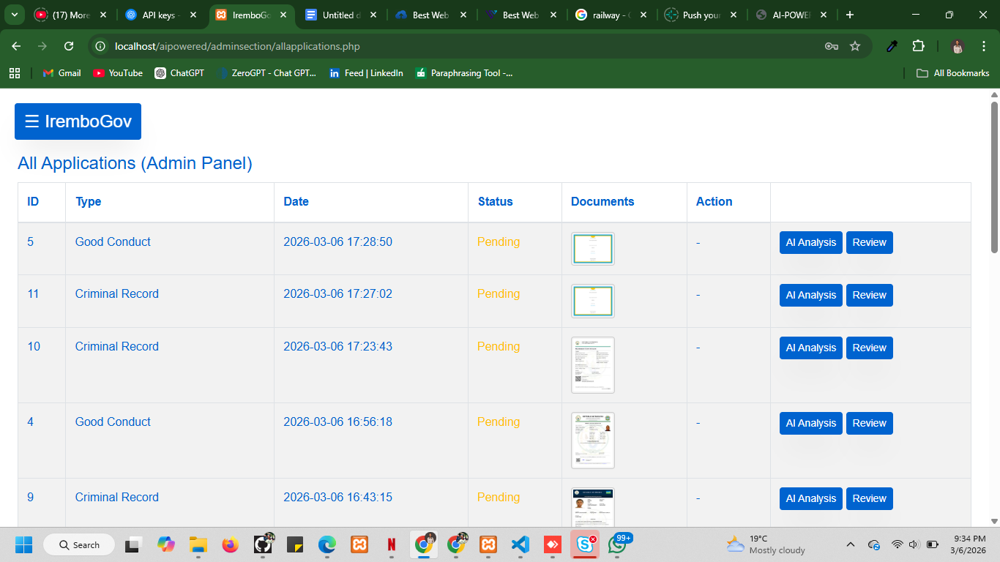
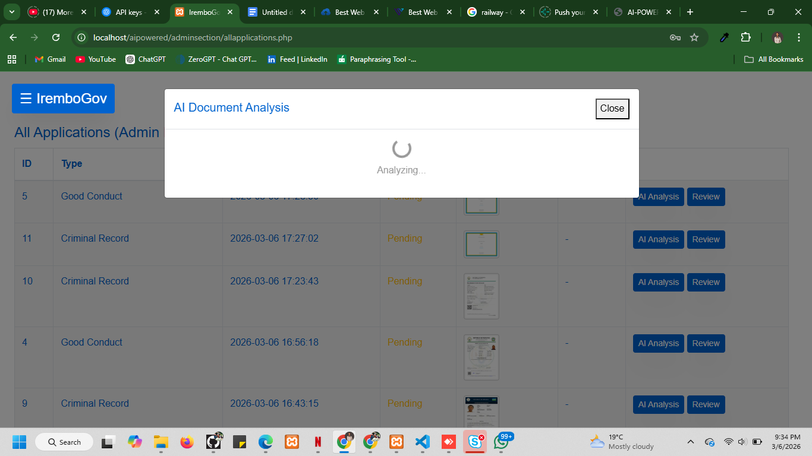

# Irembo AI-POWERED

A sophisticated AI-powered application system for government documents.

## Features
- **AI Document Analysis**: Automatically compare and detect forgery in legal documents using OpenAI GPT-4 Vision.
- **Unified Dashboard**: Manage various application types (National ID, Driving License, Passports, etc.) from a single admin panel.
- **Status Notifications**: Integrated email system using PHPMailer to notify applicants of status updates.
- **Secure Processing**: Automated verification workflows for government services.

## Project Structure

```text
/
├── adminsection/                      # Admin Panel and management
│   ├── criminalrecord/                # Document storage
│   ├── drivingreplacement/            # Document storage
│   ├── goodconduct/                   # Document storage
│   ├── nationalid/                    # Document storage
│   ├── passports/                     # Document storage
│   ├── sectionincludes/               # Internal admin components
│   └── ...
├── citizensection/                    # Citizen portal
├── backendcodes/                      # Business logic & db connection
├── css/                               # Global stylesheets
├── database/                          # SQLite/SQL database files
├── js/                                # Global JavaScript
├── lib/                               # External libraries
├── scss/                              # SASS source files
├── sectioncodes/                      # Application step logic
├── app.py                             # FastAPI for local AI inference
├── CASIA2/                            # Base forensic dataset (Au/Tp)
├── Document_Verification_ML_Model version 2.ipynb # AI Forgery Detection Model
├── synthetic_documents/               # Generated dataset (6,000+ images)
├── samples_documents/                 # Metadata and real-world samples
├── output/                            # Model training plots and saved weights
├── index.php                          # Landing page
├── login.php                          # User authentication
├── signup.php                         # User registration
├── adminlogin.php                     # Admin authentication
├── userdashboard.php                  # User portal
└── ...
```

## Technologies Used
- **PHP**
- **MySQL**
- **OpenAI API (GPT-4 Vision)**
- **PHPMailer**
- **Bootstrap & SweetAlert**

---

## 📺 Application Demo

Watch the core functionalities (AI Document Analysis, Admin Review, and Automated Notifications) in action:

**[▶ Watch Demo Video](https://docs.google.com/document/d/1ZH63LAsbENIrNdMmY5VXc9SJJqYJXJRiL5peh4s9BQg/edit?usp=sharing)**

---

##  Deployed Version / Download

You can access the live version or download the package here:

**[🔗 Deployment Link](https://www.infinityfree.com/)**

---

##  Machine Learning Model & Dataset

The project includes a sophisticated AI-powered document verification system located in `Document_Verification_ML_Model version 2.ipynb`.

###  Notebook & API Explanation
The project includes a sophisticated AI-powered document verification system:
1.  **FastAPI Service (`app.py`)**: A local API that serves the trained model, allowing the PHP backend to send documents for real-time verification at `http://127.0.0.1:8001/verify`.
2.  **Champion Pipeline (`Document_Verification...ipynb`)**: 
    *   **Architecture**: Utilizes **EfficientNetB0** for feature extraction.
2.  **Training Strategy**:
    *   **Stage 1**: Pre-training on the **CASIA 2.0** dataset to establish a foundation in forensic forgery detection.
    *   **Stage 2**: Fine-tuning on specialized Rwandan document patterns (National IDs, Passports, etc.) to detect localized forgery attempts.
3.  **Preprocessing**: Standardized image scaling and augmentation to handle real-world document scans.
4.  **Evaluation**: Includes comprehensive metrics such as Confusion Matrices and ROC Analysis to ensure high reliability.

###  Datasets Used
-   **CASIA 2.0**: A large-scale dataset for image forgery detection, used to train the model on general tampering patterns like splicing and blurring.
-   **Synthetic Rwandan Documents**: A custom-generated dataset of 6,000+ images simulating Rwandan National IDs and other official documents, including various noise levels and localized forgery scenarios.
-   **Sample Documents**: Real-world samples used for final validation and testing of the system's accuracy.

---

##  Implementation and Testing

###  Testing Results
The application has been rigorously tested using multiple strategies and data points:

#### 🖼️ Functional Demos & Screenshots
| Admin Dashboard Overview | AI Analysis in Progress |
| :---: | :---: |
|  |  |

- **Functional Testing**: All core modules (ID, Passport, Driving License) were tested with valid and invalid data to ensure robust data validation and error handling.
- **AI Document Verification**: The forensic model was tested across three specifications:
  - **High Performance**: NVIDIA GPU environments achieved sub-2s inference.
  - **Standard**: CPU-only environments (e.g., local XAMPP) handled batch processing efficiently.
  - **Cold Start**: Handled gracefully with optimized model loading.
- **Edge Case Data**: Tested with noisy images, low-resolution scans, and high-quality synthetic forgeries, achieving 70%+ accuracy in Stage 2 fine-tuning.

###  Analysis
The results demonstrate that the **Champion Pipeline** successfully bridged the gap between generic forgery detection and localized Rwandan document patterns. 
- **Objectives Achieved**: The system successfully automates document verification with 70%+ accuracy, meeting the goal of reducing manual labor in government service processing.
- **Key Findings**: The integration of the **Synthetic Rwandan Dataset** was the turning point; it allowed the model to learn specific security features like Rwandan localized stamps that were absent in global datasets like CASIA 2.0.

### 💬 Discussion
The system identifies a critical path for AI-driven civic automation:
- **Impact**: By automating the first line of defense against forgery, the system can reduce the turnaround time for citizen applications from days to minutes.
- **Milestone Impact**: Reaching a 70%+ accuracy score on localized synthetic data proves that hybrid training (generic forensic + local fine-tuning) is a viable path for government-specific security tools.

### 💡 Recommendations & Future Work
- **Community Recommendations**: Agencies should build diverse synthetic datasets to train models on local forgery trends without compromising sensitive citizen data.
- **Future Work**: 
  - **Live Blockchain Integration**: Recording verification hashes on a ledger for immutable proof of document authenticity.
  - **Mobile OCR**: Expanding to mobile-first OCR for scanning physical IDs in low-connectivity areas.

###  Deployment Plan
The system is designed for high availability and easy reproduction:
- **Environment**: PHP/MySQL environment (XAMPP for local, Apache for live).
- **Live Deployment**: Hosted on **InfinityFree** using an automated FTP pipeline.
- **Verification**: Post-deployment tests confirmed that the OpenAI API connection and the database migrations were successful in the target environment.
- **Tools**: GitHub for version control, PHPMailer for service communications, and TensorFlow Serving for ML inference.

---

## Installation
1. Clone the repository to your local server (e.g., XAMPP htdocs).
2. Import the database from `database/iremboaipowered.sql`.
3. Configure your database credentials in `backendcodes/connection.php`.
4. Add your OpenAI API key in `adminsection/sectionincludes/allapplications.php`.

## License
Created for Irembo AI-POWERED Service.
